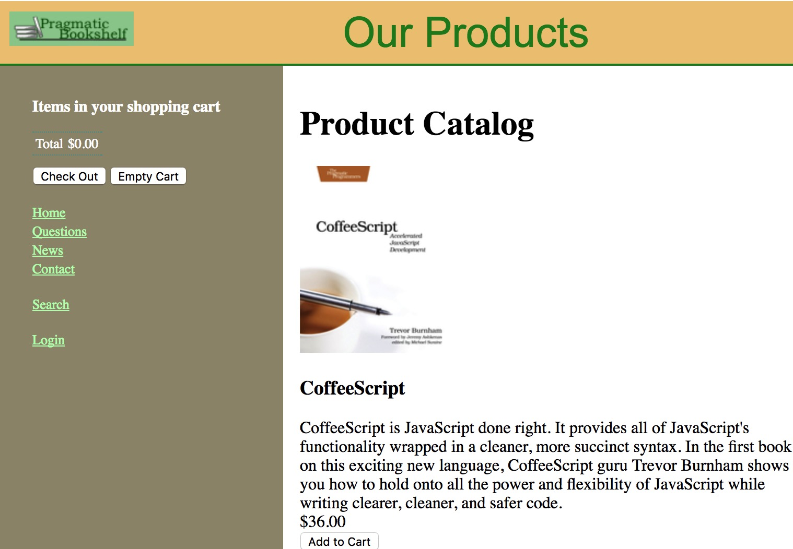
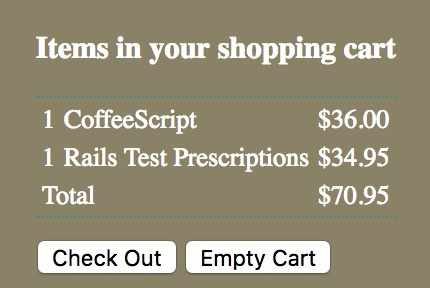
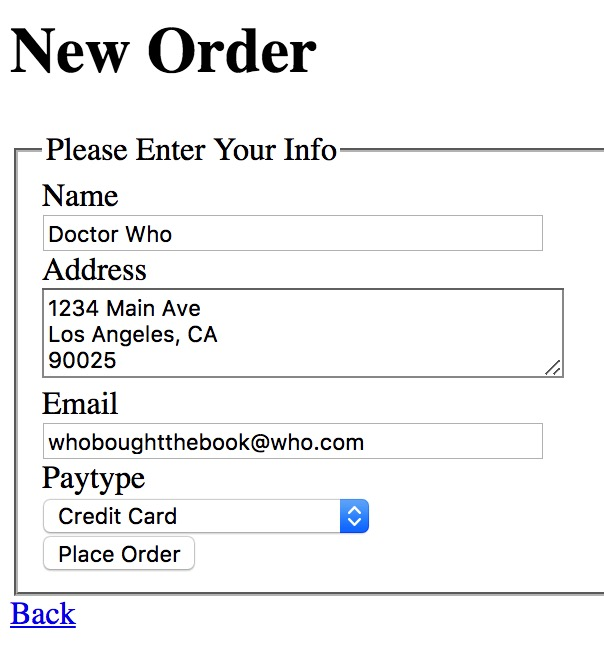

# Online Book Store Website

<<<<<<< HEAD
A bookstore website based on Ruby-on-Rails framework for student to trade used textbooks.

Developed RESTful APIs which enable CRUD operations for books and authentication for sellers. Allows shoppers to browse the books and search by attributes, add books to shopping cart, and check out.

=======
In app:

username: Jingnong

password: 123

* Implemented an online bookstore website based on Ruby-on-Rails framework for student to trade textbooks.
* Developed RESTful APIs which enable the store owner to log in to check/add/edit/delete products, and allow
shoppers to browse/search the products, add products to shopping cart, and check out.
* Allows users to filter the search results by available book attributes such as name, description and price.
* Used SQLite3 for database. Deployed the project on AWS to store and maintain the merchandise data.
>>>>>>> f525d1bbb0c0d833530ae5055de6abaaf148cf82
